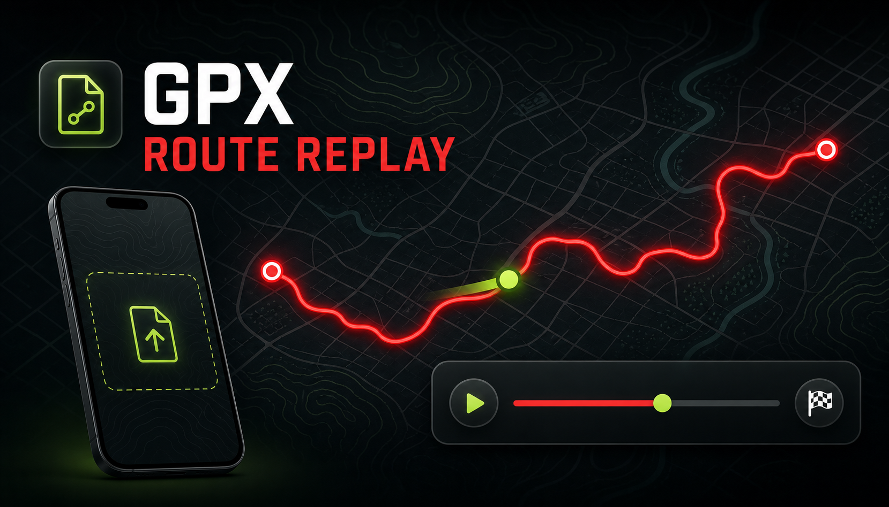

<p align="center">
  <a href="https://stanleycheng.github.io/GPXRouteReplay/">
    
  </a>
</p>

<h1 align="center">GPXRouteReplay</h1>

<p align="center">
  <strong>Replay GPX tracks and Garmin FIT activities as an animated 2D/3D map — in the browser, with nothing uploaded to a server.</strong>
</p>

<p align="center">
  <a href="https://stanleycheng.github.io/GPXRouteReplay/"><strong>▶ Open the live app</strong></a>
</p>

---

## Summary

GPXRouteReplay is a single-page web app for reviewing recorded workouts and rides. Pick a `.gpx` track or a Garmin activity `.fit` file from your device and the app cleans it up, draws it on an interactive map, and animates a marker along the route while distance, elapsed time, elevation, and heart rate stay in sync. It is built for anyone who wants to see where they went — runners, cyclists, hikers, and the people they send the link to — without installing anything or handing their GPS data to a service.

| | |
| --- | --- |
| **Input** | `.gpx` tracks and Garmin activity `.fit` files (Garmin FIT SDK) |
| **Output** | Interactive 2D/3D map replay, plus MP4/WebM screen recording of the replay |
| **Processing** | 100% client-side: parsing, filtering, rendering, and video encoding happen in your browser |
| **Storage** | Route stays in local storage on your own device; nothing is uploaded |
| **Languages** | English and Traditional Chinese, switchable in the header |
| **Stack** | Vanilla ES modules, MapLibre GL JS, esbuild, `@garmin/fitsdk`, `mp4-muxer` |
| **Live app** | <https://stanleycheng.github.io/GPXRouteReplay/> |

### Preview

[](https://stanleycheng.github.io/GPXRouteReplay/)

---

## What it does

Open a `.gpx` file or a Garmin activity `.fit` file from your device and watch the route draw itself on the map, synced with distance, elapsed time, elevation, and heart rate.

- **GPX and FIT import** — parsed locally; FIT uses the official Garmin FIT SDK.
- **GPS spike filtering** — points implying more than 200 km/h are dropped, so a bad GPS fix never launches the marker into the sea.
- **Timestamp normalization** — malformed, missing, or duplicate timestamps are repaired into a monotonic timeline instead of breaking playback.
- **2D and 3D replay** — optional 3D terrain with pitch/bearing, plus a follow-camera mode that can be paused by panning the map.
- **Playback control** — play/pause, restart, scrub the progress bar, and speeds from 0.05× to 4×.
- **Map decorations** — kilometre markers and start/finish pins.
- **Video export** — record the replay to MP4 (H.264 via WebCodecs, `mp4-muxer`) with a WebM `MediaRecorder` fallback, then save or share the file.
- **Bilingual UI** — English and Traditional Chinese, switchable in the header.
- **Offline-friendly** — the last opened route reopens automatically on the same device.

## Privacy

Your activity file never leaves your device. Everything — parsing, filtering, rendering, and video encoding — happens in the browser, and the loaded route is only persisted to local storage on your own device. The page is served through GitHub Pages with no analytics beyond Google Analytics page views.

## Getting started

1. Open the [live app](https://stanleycheng.github.io/GPXRouteReplay/).
2. Choose **Choose GPX/FIT** and pick a `.gpx` or `.fit` file from Files/iCloud Drive (or drag-free import via the settings panel).
3. Press **▶** to replay, or use the settings panel to toggle kilometre markers, start/finish pins, 3D terrain, follow camera, and video recording.

### Browser support

Built and tested for Safari 16.4+ and current Chrome/Edge. 3D terrain and video export need the newest engines; if video encoding is unavailable, the app tells you instead of failing silently.

## Development

```bash
npm ci                                  # install exact dependency versions
npm test                                # route filtering + timestamp normalization tests
npm run build                           # regenerate docs/ (GitHub Pages) and dist/ (OpenAI hosting)
python -m http.server 8000 --directory docs   # serve the built site locally
```

Run `npm test` before `npm run build`. Rebuild whenever `index.html`, `route-core.mjs`, dependencies, or `public/` assets change, and commit the regenerated `docs/` output together with the source change.

### Project structure

| Path | Purpose |
| --- | --- |
| `index.html` | UI, styles, GPX/FIT import flow, map + playback logic |
| `route-core.mjs` | Testable route processing: haversine distance, GPS spike filter, timestamp normalization |
| `route-recorder.mjs` | Map video recording (WebCodecs/MP4 + MediaRecorder/WebM) |
| `*.test.mjs` | Node test suites (`node:assert/strict`, no framework) |
| `build.mjs` | esbuild bundling of route logic + FIT SDK into `docs/` and `dist/` |
| `public/` | Source images: favicons, social card |
| `docs/` | Generated GitHub Pages output (committed) |
| `dist/` | Generated OpenAI hosting output (ignored) |

### Map tiles

The committed Pages build ships without a MapTiler key and falls back to the OpenFreeMap bright style. Set `__MAPTILER_KEY__` (see `build.mjs`) to use MapTiler streets + terrain-RGB for the 3D terrain layer. Never commit an API key.

## Deployment

- **GitHub Pages** — `main` branch, `/docs` folder: <https://stanleycheng.github.io/GPXRouteReplay/>
- **OpenAI hosting** — `npm run build` also emits `dist/` with `.openai/hosting.json` and a Worker that serves the single-file app, injecting the `MAPTILER_KEY` environment variable at runtime.

## License

No license file yet — treat this repository as all rights reserved until one is added.
